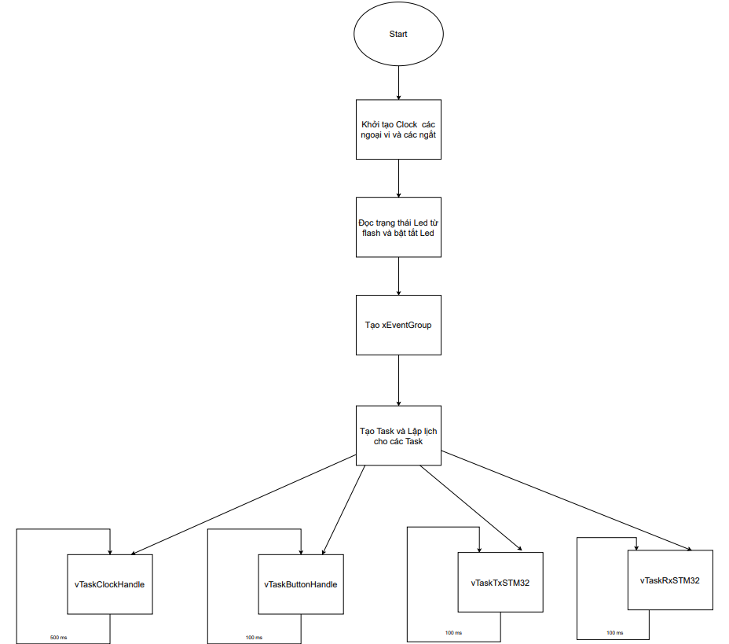
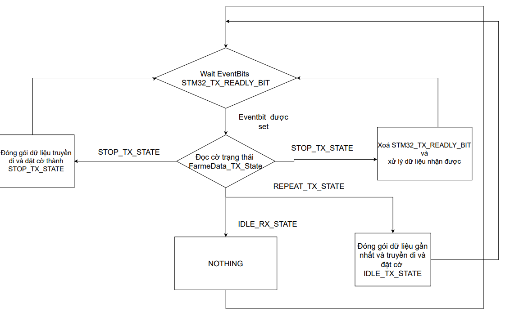
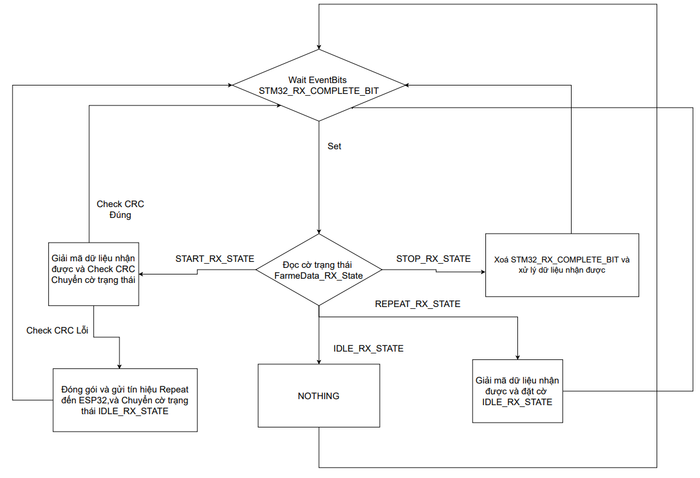
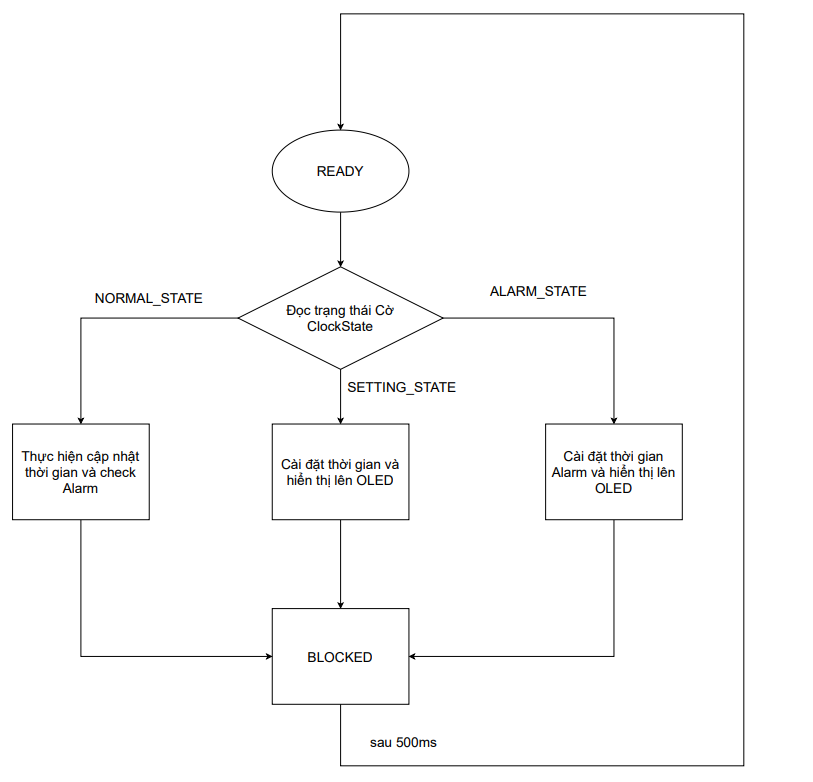
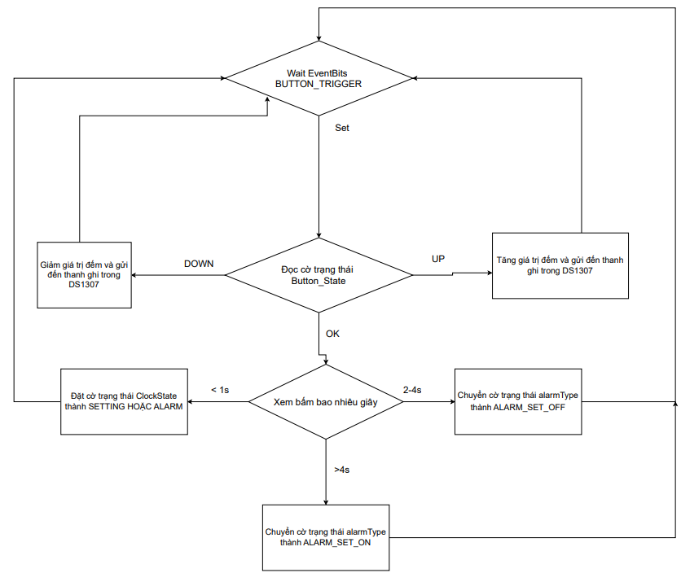
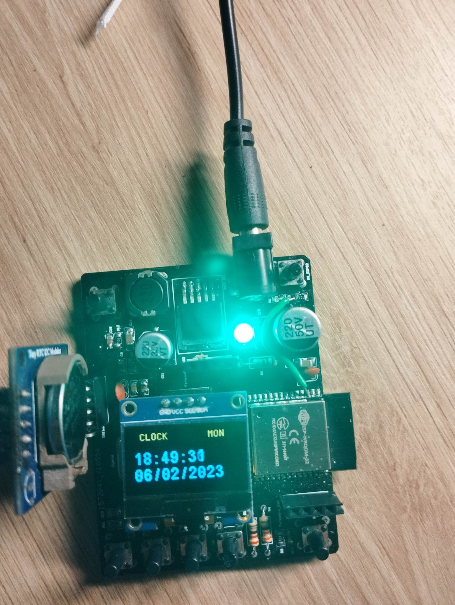

| Supported Targets | STM32F103C8T6 |
| ----------------- | ------------- |

# Giới thiệu chung
Project này nhằm tạo ra 1 thiết bị hẹn giờ bật tắt thiết bị.Có thể cài đặt thời gian online từ người dùng có Internet hoặc cài đặt Local khi mất mạng.Dự án này sử dụng MCU STM32F103C8T6(HAL) và module wifi ESP32

  ---

# Yêu cầu hệ thống

1. Phiên bản ESP-IDF từ 3.5 trở lên

---

# Các tính năng của hệ thống
- Có thể cài đặt thời gian hẹn giờ khi có mạng hoặc mất mạng trên Browser
- Phát hiện mất điện bằng bộ PVD(Progamable Voltage Detector) để kịp lưu trạng thái led vào Flash 
- Có thể sửa đổi thông tin wifi trên Browser
- Phát hiện lỗi bản tin bằng CRC checksum và gửi lại

---
# Lưu đồ thuật toán của STM32F103C8T6 dùng RTOS
##### Hàm main

---

##### Task gửi dữ liệu đến ESP32

---

##### Task nhận dữ liệu từ ESP32

---

##### Task clock DS1307 control

---

##### Task Button Control

---

# Demo hệ thống

---
